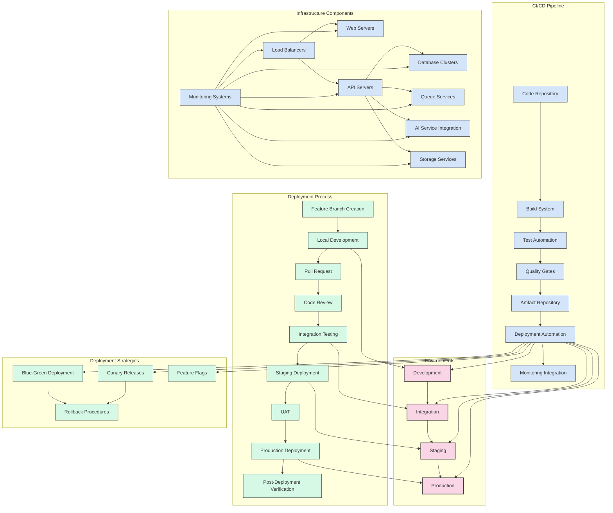
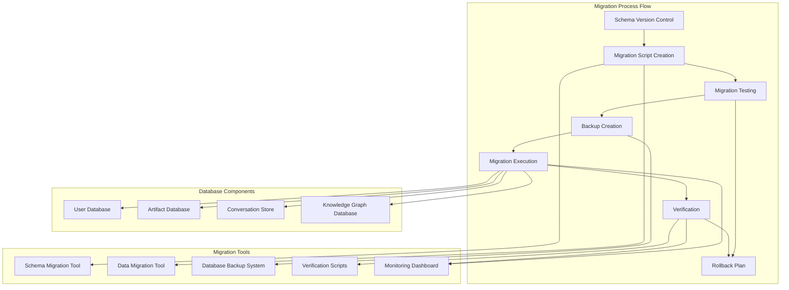
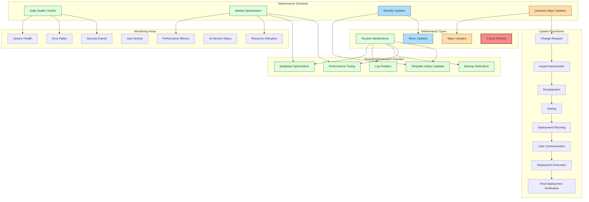
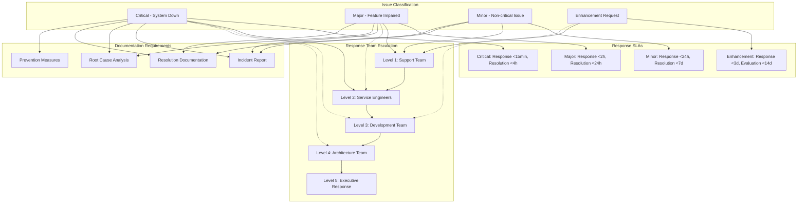

## 10. Deployment and Maintenance

### 10.1 Deployment Strategy

#### Database Migration Strategy

### 10.2 Maintenance Guidelines

#### Performance Monitoring Heatmap

```mermaid
graph TD
    subgraph "System Component Monitoring Priority"
        S1[Conversation Service]
        S2[Artifact Service]
        S3[Agent Service]
        S4[Knowledge Service]
        S5[Export Service]
        S6[Databases]
        S7[AI Integration]
        S8[File Storage]
    end

    subgraph "Conversation Service Metrics"
        CS1[Response Time]:::critical
        CS2[Message Throughput]:::major
        CS3[AI Model Latency]:::critical
        CS4[Context Loading Time]:::major
        CS5[Error Rate]:::critical
    end

    subgraph "Artifact Service Metrics"
        AS1[Creation Time]:::major
        AS2[Update Latency]:::minor
        AS3[Version Control Operations]:::major
        AS4[Template Rendering]:::major
        AS5[Error Rate]:::critical
    end

    subgraph "Agent Service Metrics"
        AGs1[Agent Initialization Time]:::major
        AGs2[Execution Duration]:::critical
        AGs3[Knowledge Retrieval Time]:::major
        AGs4[Response Generation Time]:::critical
        AGs5[Error Rate]:::critical
    end

    subgraph "Knowledge Service Metrics"
        KS1[Search Response Time]:::critical
        KS2[Graph Operation Latency]:::major
        KS3[Knowledge Extraction Time]:::minor
        KS4[Relationship Mapping Time]:::minor
        KS5[Query Complexity]:::major
    end

    subgraph "Database Metrics"
        DB1[Query Performance]:::critical
        DB2[Connection Pool Utilization]:::major
        DB3[Storage Growth Rate]:::minor
        DB4[Index Efficiency]:::major
        DB5[Replication Lag]:::critical
    end

    S1 --> CS1
    S1 --> CS2
    S1 --> CS3
    S1 --> CS4
    S1 --> CS5

    S2 --> AS1
    S2 --> AS2
    S2 --> AS3
    S2 --> AS4
    S2 --> AS5

    S3 --> AGs1
    S3 --> AGs2
    S3 --> AGs3
    S3 --> AGs4
    S3 --> AGs5

    S4 --> KS1
    S4 --> KS2
    S4 --> KS3
    S4 --> KS4
    S4 --> KS5

    S6 --> DB1
    S6 --> DB2
    S6 --> DB3
    S6 --> DB4
    S6 --> DB5

    classDef critical fill:#ff8888,stroke:#333,stroke-width:2px
    classDef major fill:#ffcc88,stroke:#333,stroke-width:1px
    classDef minor fill:#88ccff,stroke:#333,stroke-width:1px
```

#### Maintenance Response Plan

This comprehensive Software Design Specification provides a detailed blueprint for the development of the Cognitive Workspace application, covering all aspects from architecture and design to deployment and maintenance. The document follows industry best practices for software design documentation and provides clear guidelines for implementation while maintaining flexibility for future expansion and adaptation.
