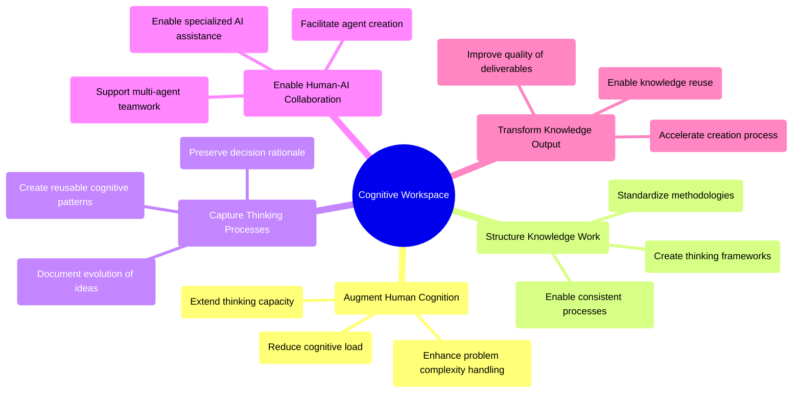
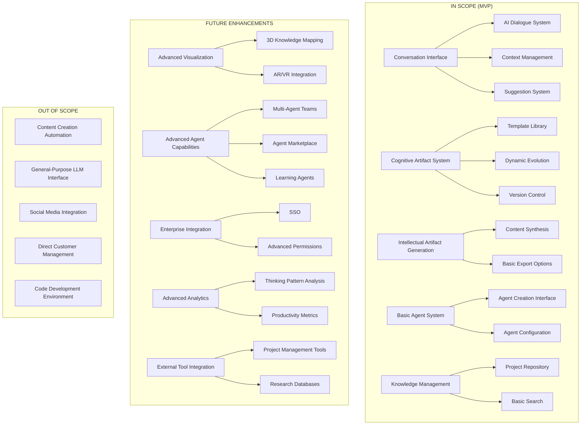

# Software Design Specification (SDS)
# Cognitive Workspace: AI-Enhanced Knowledge Work Platform

## 1. Executive Summary

### 1.1 Purpose

The Cognitive Workspace system is designed to transform knowledge work by providing an AI-powered environment where thinking processes are externalized through dynamic cognitive artifacts that evolve into polished intellectual outputs.

### 1.2 Scope

### 1.3 Key Outcomes (ODI)

| Unmet Customer Need | Outcome Metric | Feature Implementation |
|---------------------|----------------|------------------------|
| Difficulty managing complexity in knowledge work | Ability to handle 50% more complex projects without increased cognitive load | Cognitive artifact templates for breaking down complex problems |
| Time wasted recreating thinking processes | 70% reduction in time spent recreating previous work | Version history and thinking process preservation |
| Ideas lost in transition from conversation to documentation | 85% of valuable insights successfully captured from discussions | Conversation-to-artifact linking system |
| Methodology inconsistency across teams | 60% improvement in methodology consistency metrics | Reusable cognitive patterns through agent system |
| Difficulty collaborating on thinking (not just documents) | 75% increase in collaborative ideation effectiveness | Real-time collaborative artifact editing |
| Knowledge loss when projects conclude | 80% of project methodology knowledge preserved for reuse | Agent creation from project artifacts |
| Trouble finding relevant previous work | 65% reduction in time spent searching for relevant past work | Knowledge graph and intelligent search system |
| Difficulty transforming rough ideas into polished outputs | 50% reduction in time from ideation to final artifact | Guided transformation from cognitive to intellectual artifacts |
| Lack of visibility into thinking processes | 85% increase in understanding of how conclusions were reached | Process visualization and decision tracking |
| Inability to leverage organizational knowledge efficiently | 70% increase in knowledge reuse across projects | Cross-project pattern recognition |

