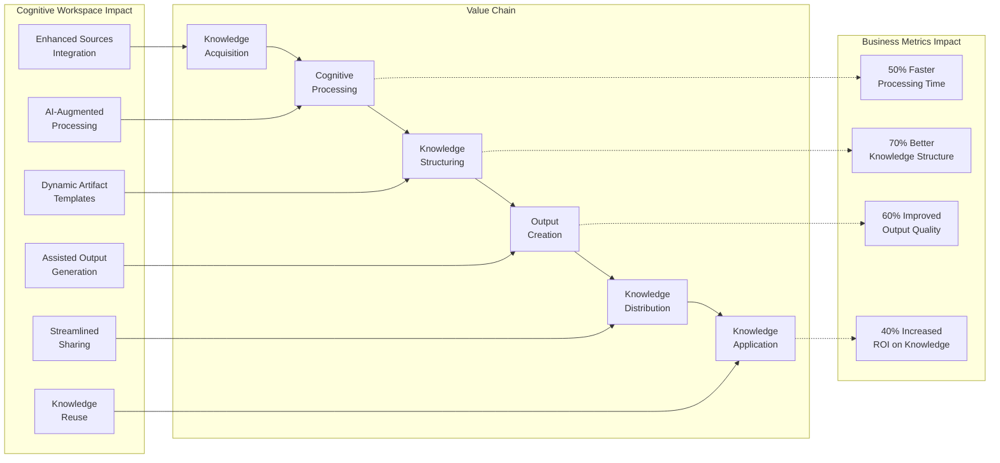
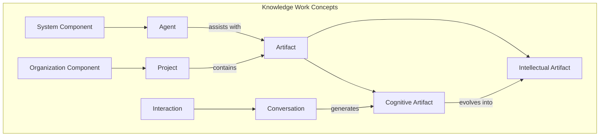

## 2. Context and Background

### 2.1 Business Context



**SBVR Vocabulary and Rules**

| Concept Type | Term | Definition | Hierarchical Relationship |
|-------------|------|------------|---------------------------|
| **Object Types** | | | |
| | Cognitive Artifact | A dynamic thinking tool that externalizes mental processes | Parent: Artifact |
| | Intellectual Artifact | A polished knowledge product representing completed work | Parent: Artifact |
| | Agent | An AI entity with specific capabilities configured to assist with knowledge work | Parent: System Component |
| | Project | A container for related artifacts and conversations | Parent: Organization Component |
| | Conversation | A dialogue between users and AI within the system | Parent: Interaction |
| **Fact Types** | | | |
| | Cognitive Artifact evolves into Intellectual Artifact | Represents the transformation process | |
| | Agent assists with Artifact | Defines the relationship between agents and artifacts | |
| | Project contains Artifact | Establishes project ownership of artifacts | |
| | Conversation generates Cognitive Artifact | Shows origin of artifacts from dialogue | |
| **Rules** | | | |
| | It is necessary that each Cognitive Artifact is associated with at least one Project | Ensures proper organization | |
| | It is necessary that each Agent has defined capabilities and permissions | Ensures proper agent configuration | |
| | It is necessary that version history is maintained for each Artifact | Ensures traceability | |
| | It is possible that a Cognitive Artifact is transformed into an Intellectual Artifact | Defines transformation potential | |
| | It is necessary that each User has authorized access to Projects they work with | Ensures proper access control | |



### 2.2 Stakeholders

```mermaid
graph TD
    classDef primary fill:#f9f,stroke:#333,stroke-width:2px
    classDef secondary fill:#bbf,stroke:#333,stroke-width:1px
    classDef tertiary fill:#dfd,stroke:#333,stroke-width:1px

    subgraph "Primary Users"
        A[Research Scientists]:::primary
        B[Strategic Consultants]:::primary
        C[Product Managers]:::primary
        D[Policy Analysts]:::primary
        E[Knowledge Management Professionals]:::primary
    end

    subgraph "Organization Stakeholders"
        F[Research Organizations]:::secondary
        G[Consulting Firms]:::secondary
        H[Technology Companies]:::secondary
        I[Government Agencies]:::secondary
        J[Educational Institutions]:::secondary
    end

    subgraph "System Stakeholders"
        K[System Administrators]:::tertiary
        L[IT Support]:::tertiary
        M[Data Security Team]:::tertiary
        N[AI Ethics Committee]:::tertiary
    end

    subgraph "Development Stakeholders"
        O[Development Team]:::tertiary
        P[Product Owners]:::tertiary
        Q[UX Designers]:::tertiary
    end

    A -->|uses| S[Cognitive Workspace System]
    B -->|uses| S
    C -->|uses| S
    D -->|uses| S
    E -->|uses| S

    F -->|owns/deploys| S
    G -->|owns/deploys| S
    H -->|owns/deploys| S
    I -->|owns/deploys| S
    J -->|owns/deploys| S

    K -->|maintains| S
    L -->|supports| S
    M -->|secures| S
    N -->|governs| S

    O -->|builds| S
    P -->|directs| S
    Q -->|designs| S
```



### 2.3 System Context Diagram

```plantuml
@startuml
!include https://raw.githubusercontent.com/plantuml-stdlib/C4-PlantUML/master/C4_Context.puml

Person(knowledgeWorker, "Knowledge Worker", "Individual who creates knowledge artifacts through research, analysis, and synthesis")
Person(teamMember, "Team Member", "Collaborator working on the same project")
Person_Ext(externalStakeholder, "External Stakeholder", "Recipient of intellectual artifacts")

System(cognitiveWorkspace, "Cognitive Workspace", "AI-enhanced knowledge work platform that supports the creation of cognitive and intellectual artifacts")

System_Ext(aiModels, "AI Models", "External AI services for natural language processing, reasoning, and content generation")
System_Ext(knowledgeSources, "Knowledge Sources", "External repositories of information and data")
System_Ext(exportDestinations, "Export Destinations", "Systems where intellectual artifacts are published or shared")
System_Ext(identityProvider, "Identity Provider", "Authentication and authorization service")

Rel(knowledgeWorker, cognitiveWorkspace, "Creates projects, engages in conversations, develops artifacts")
Rel(teamMember, cognitiveWorkspace, "Collaborates on projects and artifacts")
Rel(cognitiveWorkspace, externalStakeholder, "Delivers intellectual artifacts")

Rel(cognitiveWorkspace, aiModels, "Uses for conversation, reasoning, and content generation")
Rel(cognitiveWorkspace, knowledgeSources, "Retrieves information from")
Rel(cognitiveWorkspace, exportDestinations, "Exports intellectual artifacts to")
Rel(cognitiveWorkspace, identityProvider, "Authenticates users through")

@enduml
```

