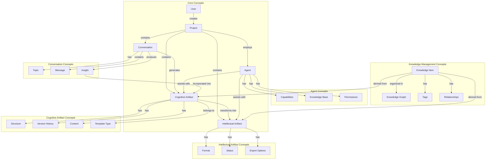
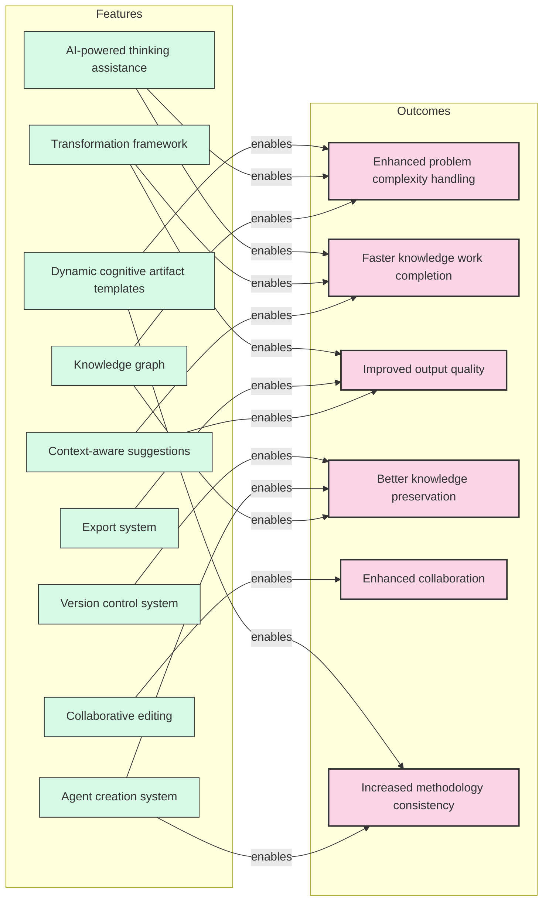

## 3. Functional Requirements

### 3.1 User Stories and Use Cases

```mermaid
graph TD
    classDef epic fill:#f9d5e5,stroke:#333,stroke-width:2px
    classDef story fill:#e3eaa7,stroke:#333,stroke-width:1px
    classDef highPriority fill:#ffb7b2,stroke:#333,stroke-width:1px
    classDef mediumPriority fill:#b5ead7,stroke:#333,stroke-width:1px
    classDef lowPriority fill:#c7ceea,stroke:#333,stroke-width:1px

    subgraph "Project Management"
        E1[Project Management]:::epic
        S1[Create new project]:::highPriority
        S2[Configure project settings]:::mediumPriority
        S3[Invite team members]:::highPriority
        S4[View project status]:::mediumPriority
        S5[Archive project]:::lowPriority

        E1 --> S1
        E1 --> S2
        E1 --> S3
        E1 --> S4
        E1 --> S5
    end

    subgraph "Cognitive Artifact Management"
        E2[Cognitive Artifact Management]:::epic
        S6[Create cognitive artifact from conversation]:::highPriority
        S7[Select artifact template]:::highPriority
        S8[Edit artifact structure]:::highPriority
        S9[Track artifact versions]:::mediumPriority
        S10[Link related artifacts]:::mediumPriority
        S11[Share artifact for collaboration]:::mediumPriority

        E2 --> S6
        E2 --> S7
        E2 --> S8
        E2 --> S9
        E2 --> S10
        E2 --> S11
    end

    subgraph "Conversation System"
        E3[Conversation System]:::epic
        S12[Engage AI in topic exploration]:::highPriority
        S13[Request artifact suggestions]:::highPriority
        S14[Receive AI feedback on artifacts]:::mediumPriority
        S15[Extract insights from conversation]:::highPriority
        S16[Save conversation highlights]:::mediumPriority

        E3 --> S12
        E3 --> S13
        E3 --> S14
        E3 --> S15
        E3 --> S16
    end

    subgraph "Intellectual Artifact Creation"
        E4[Intellectual Artifact Creation]:::epic
        S17[Transform cognitive artifact to intellectual artifact]:::highPriority
        S18[Format intellectual artifact]:::mediumPriority
        S19[Review and finalize content]:::highPriority
        S20[Export in multiple formats]:::mediumPriority
        S21[Publish to external systems]:::lowPriority

        E4 --> S17
        E4 --> S18
        E4 --> S19
        E4 --> S20
        E4 --> S21
    end

    subgraph "Agent System"
        E5[Agent System]:::epic
        S22[Create specialized agent]:::highPriority
        S23[Configure agent capabilities]:::mediumPriority
        S24[Assign agent to project]:::mediumPriority
        S25[Monitor agent performance]:::lowPriority
        S26[Modify agent behavior]:::lowPriority

        E5 --> S22
        E5 --> S23
        E5 --> S24
        E5 --> S25
        E5 --> S26
    end

    subgraph "Knowledge Management"
        E6[Knowledge Management]:::epic
        S27[Search across artifacts]:::highPriority
        S28[Discover related content]:::mediumPriority
        S29[Identify reusable patterns]:::mediumPriority
        S30[Build knowledge graph]:::lowPriority
        S31[Track knowledge evolution]:::lowPriority

        E6 --> S27
        E6 --> S28
        E6 --> S29
        E6 --> S30
        E6 --> S31
    end
```

### 3.2 SBVR Models

```mermaid
graph TD
    subgraph "Core Concepts"
        A[User] -->|creates| B[Project]
        B -->|contains| C1[Conversation]
        B -->|contains| C2[Cognitive Artifact]
        B -->|contains| C3[Intellectual Artifact]
        B -->|employs| C4[Agent]

        C1 -->|generates| C2
        C2 -->|transforms into| C3
        C4 -->|assists with| C2
        C4 -->|assists with| C3
    end

    subgraph "Conversation Concepts"
        C1 -->|has| D1[Topic]
        C1 -->|contains| D2[Message]
        C1 -->|produces| D3[Insight]
        D3 -->|incorporated into| C2
    end

    subgraph "Cognitive Artifact Concepts"
        C2 -->|has| E1[Structure]
        C2 -->|has| E2[Version History]
        C2 -->|has| E3[Content]
        C2 -->|belongs to| E4[Template Type]
    end

    subgraph "Intellectual Artifact Concepts"
        C3 -->|has| F1[Format]
        C3 -->|has| F2[Status]
        C3 -->|has| F3[Export Options]
    end

    subgraph "Agent Concepts"
        C4 -->|has| G1[Capabilities]
        C4 -->|has| G2[Knowledge Base]
        C4 -->|has| G3[Permissions]
    end

    subgraph "Knowledge Management Concepts"
        H1[Knowledge Item] -->|derived from| C2
        H1 -->|derived from| C3
        H1 -->|organized in| H2[Knowledge Graph]
        H1 -->|has| H3[Tags]
        H1 -->|has| H4[Relationships]
    end
```

### 3.3 Outcome Mapping (ODI)

```mermaid
graph LR
    classDef outcome fill:#f9d5e5,stroke:#333,stroke-width:2px
    classDef feature fill:#d5f9e5,stroke:#333,stroke-width:1px

    subgraph "Outcomes"
        O1[Enhanced problem complexity handling]:::outcome
        O2[Faster knowledge work completion]:::outcome
        O3[Improved output quality]:::outcome
        O4[Better knowledge preservation]:::outcome
        O5[Enhanced collaboration]:::outcome
        O6[Increased methodology consistency]:::outcome
    end

    subgraph "Features"
        F1[Dynamic cognitive artifact templates]:::feature
        F2[AI-powered thinking assistance]:::feature
        F3[Transformation framework]:::feature
        F4[Version control system]:::feature
        F5[Collaborative editing]:::feature
        F6[Agent creation system]:::feature
        F7[Knowledge graph]:::feature
        F8[Export system]:::feature
        F9[Context-aware suggestions]:::feature
    end

    F1 -->|enables| O1
    F1 -->|enables| O6
    F2 -->|enables| O1
    F2 -->|enables| O2
    F3 -->|enables| O2
    F3 -->|enables| O3
    F4 -->|enables| O4
    F5 -->|enables| O5
    F6 -->|enables| O6
    F6 -->|enables| O4
    F7 -->|enables| O4
    F7 -->|enables| O1
    F8 -->|enables| O3
    F9 -->|enables| O2
    F9 -->|enables| O3
```
