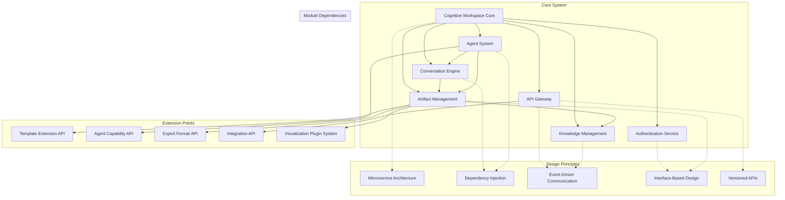

## 4. Non-Functional Requirements

### 4.1 Performance Requirements

```mermaid
graph TD
    subgraph "Performance Requirements Radar"
        direction TB

        A[Response Time]
        B[Scalability]
        C[Reliability]
        D[Throughput]
        E[Resource Utilization]

        style A fill:#f9f,stroke:#333,stroke-width:2px
        style B fill:#bbf,stroke:#333,stroke-width:2px
        style C fill:#dfd,stroke:#333,stroke-width:2px
        style D fill:#fdd,stroke:#333,stroke-width:2px
        style E fill:#dff,stroke:#333,stroke-width:2px
    end

    A --- A1[AI Response < 2s]
    A --- A2[UI Interaction < 200ms]
    A --- A3[Artifact Generation < 5s]

    B --- B1[Support 500+ users per instance]
    B --- B2[Handle 100+ concurrent active users]
    B --- B3[10,000+ artifacts per organization]

    C --- C1[99.9% uptime SLA]
    C --- C2[Data durability 99.999%]
    C --- C3[Zero data loss on failures]

    D --- D1[Process 50+ messages/second]
    D --- D2[Generate 20+ artifacts/minute]
    D --- D3[Support 5+ active conversations per user]

    E --- E1[CPU: Max 70% sustained load]
    E --- E2[Memory: < 4GB per user session]
    E --- E3[Storage: Optimized for text-based artifacts]
```

### 4.2 Security and Compliance

```mermaid
graph TD
    subgraph "Threat Model"
        T1[Unauthorized Access] --> V1[User Authentication]
        T1 --> V2[Session Management]
        T1 --> V3[Role-Based Access Controls]

        T2[Data Exposure] --> V4[Data Encryption]
        T2 --> V5[Network Security]
        T2 --> V6[Secure Storage]

        T3[AI Security Risks] --> V7[AI Safety Controls]
        T3 --> V8[Content Filtering]
        T3 --> V9[Model Guardrails]

        T4[Privacy Concerns] --> V10[Data Minimization]
        T4 --> V11[User Consent]
        T4 --> V12[Data Retention Policies]

        T5[Compliance Risks] --> V13[Audit Logging]
        T5 --> V14[Compliance Reporting]
        T5 --> V15[Regulatory Adaptability]
    end

    subgraph "Security Controls"
        V1 --> C1[Multi-factor Authentication]
        V1 --> C2[SSO Integration]

        V2 --> C3[Token-based Sessions]
        V2 --> C4[Automatic Session Timeouts]

        V3 --> C5[Permission Management System]
        V3 --> C6[Access Auditing]

        V4 --> C7[TLS 1.3 for Transport]
        V4 --> C8[AES-256 for Data at Rest]

        V5 --> C9[WAF Implementation]
        V5 --> C10[API Gateway Security]

        V6 --> C11[Secure Key Management]
        V6 --> C12[Isolated Storage Containers]

        V7 --> C13[LLM Safety Filters]
        V7 --> C14[Content Generation Boundaries]

        V8 --> C15[Input Validation]
        V8 --> C16[Output Sanitization]

        V9 --> C17[Model Usage Policies]
        V9 --> C18[Response Auditing]

        V10 --> C19[Purpose Limitation]
        V10 --> C20[Data Collection Controls]

        V11 --> C21[Transparent Privacy Notices]
        V11 --> C22[Consent Management]

        V12 --> C23[Automated Data Purging]
        V12 --> C24[Data Lifecycle Management]

        V13 --> C25[Comprehensive Event Logging]
        V13 --> C26[Tamper-proof Audit Records]

        V14 --> C27[Compliance Dashboard]
        V14 --> C28[Automated Report Generation]

        V15 --> C29[Configurable Compliance Settings]
        V15 --> C30[Regulatory Update Process]
    end
```

### 4.3 Scalability

```mermaid
graph TD
    subgraph "Scaling Dimensions"
        U[Users]
        P[Projects]
        A[Artifacts]
        AI[AI Processing]
        S[Storage]
    end

    subgraph "Scaling Approaches"
        HS[Horizontal Scaling]
        VS[Vertical Scaling]
        CS[Caching Strategies]
        PS[Partitioning Strategies]
    end

    U --> U1[Growth Projection:<br>5K to 50K users in 18 months]
    U --> U2[Scaling Trigger:<br>3K concurrent users]
    U --> U3[Target Response:<br>Add application instances]

    P --> P1[Growth Projection:<br>25K to 250K projects in 18 months]
    P --> P2[Scaling Trigger:<br>Performance degradation in project listings]
    P --> P3[Target Response:<br>Implement pagination and indexing optimizations]

    A --> A1[Growth Projection:<br>100K to 5M artifacts in 18 months]
    A --> A2[Scaling Trigger:<br>Storage capacity at 70%]
    A --> A3[Target Response:<br>Add storage nodes and implement sharding]

    AI --> AI1[Growth Projection:<br>10K to 100K daily AI requests in 18 months]
    AI --> AI2[Scaling Trigger:<br>AI response time exceeding 2s]
    AI --> AI3[Target Response:<br>Add AI processing capacity and optimize caching]

    S --> S1[Growth Projection:<br>5TB to 50TB in 18 months]
    S --> S2[Scaling Trigger:<br>Storage capacity at 70%]
    S --> S3[Target Response:<br>Expand storage cluster]

    U3 --> HS
    P3 --> CS
    A3 --> PS
    AI3 --> HS
    S3 --> VS
```

### 4.4 Maintainability and Extensibility

```mermaid
graph TD
    subgraph "Core System"
        A[Cognitive Workspace Core]
        B[API Gateway]
        C[Authentication Service]
        D[Conversation Engine]
        E[Artifact Management]
        F[Agent System]
        G[Knowledge Management]
    end

    subgraph "Extension Points"
        EP1[Template Extension API]
        EP2[Agent Capability API]
        EP3[Export Format API]
        EP4[Integration API]
        EP5[Visualization Plugin System]
    end

    subgraph "Module Dependencies"
        A --> B
        A --> C
        A --> D
        A --> E
        A --> F
        A --> G

        D --> E
        E --> G
        F --> D
        F --> E

        E --> EP1
        F --> EP2
        E --> EP3
        B --> EP4
        E --> EP5
    end

    subgraph "Design Principles"
        DP1[Microservice Architecture]
        DP2[Dependency Injection]
        DP3[Event-Driven Communication]
        DP4[Interface-Based Design]
        DP5[Versioned APIs]
    end

    A -.-> DP1
    B -.-> DP3
    B -.-> DP5
    C -.-> DP4
    D -.-> DP2
    E -.-> DP4
    F -.-> DP2
    G -.-> DP3
```

