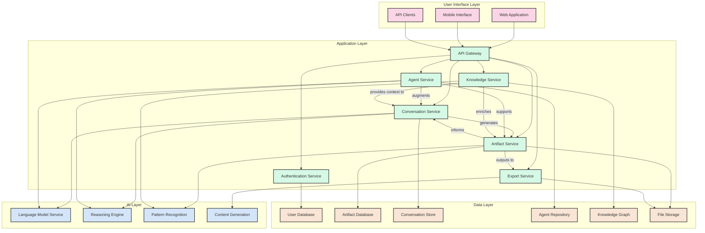
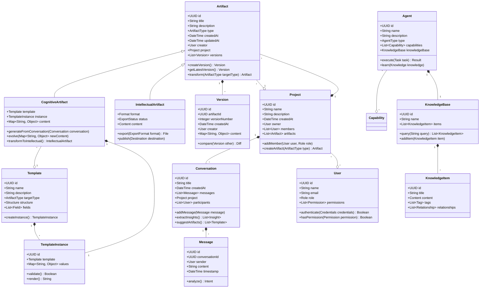

## 5. Architecture and Design

### 5.1 System Overview



### 5.2 Container Diagram

```plantuml
@startuml
!include https://raw.githubusercontent.com/plantuml-stdlib/C4-PlantUML/master/C4_Container.puml

Person(user, "Knowledge Worker", "User who creates and manages knowledge artifacts")

System_Boundary(cognitive_workspace, "Cognitive Workspace System") {
    Container(web_app, "Web Application", "React, TypeScript", "Provides the primary user interface for the system")
    Container(mobile_app, "Mobile Application", "React Native", "Provides mobile access to the system")

    Container(api_gateway, "API Gateway", "Node.js, Express", "Routes requests to appropriate services")
    Container(auth_service, "Authentication Service", "Node.js, Passport", "Handles user authentication and authorization")

    Container(conversation_service, "Conversation Service", "Python, FastAPI", "Manages AI conversations and interactions")
    Container(artifact_service, "Artifact Service", "Python, FastAPI", "Handles cognitive and intellectual artifacts")
    Container(agent_service, "Agent Service", "Python, FastAPI", "Manages AI agents and their behaviors")
    Container(knowledge_service, "Knowledge Service", "Python, FastAPI", "Handles knowledge management and retrieval")
    Container(export_service, "Export Service", "Node.js, Express", "Manages export and publishing of artifacts")

    ContainerDb(user_db, "User Database", "PostgreSQL", "Stores user profiles and settings")
    ContainerDb(artifact_db, "Artifact Database", "PostgreSQL", "Stores artifact metadata and structure")
    ContainerDb(conversation_db, "Conversation Store", "MongoDB", "Stores conversation history")
    ContainerDb(agent_db, "Agent Repository", "MongoDB", "Stores agent configurations and knowledge")
    ContainerDb(knowledge_db, "Knowledge Graph Database", "Neo4j", "Stores knowledge relationships")
    ContainerDb(file_store, "File Storage", "S3-compatible", "Stores document content and binary assets")
}

System_Ext(llm_service, "Large Language Model Service", "Provides AI capabilities for conversation and content generation")
System_Ext(identity_provider, "Identity Provider", "Provides authentication services")
System_Ext(export_targets, "Export Destinations", "Systems where artifacts can be published or shared")

Rel(user, web_app, "Uses")
Rel(user, mobile_app, "Uses")

Rel(web_app, api_gateway, "Makes API calls to", "HTTPS/JSON")
Rel(mobile_app, api_gateway, "Makes API calls to", "HTTPS/JSON")

Rel(api_gateway, auth_service, "Routes auth requests to", "HTTPS/JSON")
Rel(api_gateway, conversation_service, "Routes conversation requests to", "HTTPS/JSON")
Rel(api_gateway, artifact_service, "Routes artifact requests to", "HTTPS/JSON")
Rel(api_gateway, agent_service, "Routes agent requests to", "HTTPS/JSON")
Rel(api_gateway, knowledge_service, "Routes knowledge requests to", "HTTPS/JSON")
Rel(api_gateway, export_service, "Routes export requests to", "HTTPS/JSON")

Rel(auth_service, identity_provider, "Authenticates with", "OIDC/OAuth2")
Rel(auth_service, user_db, "Reads from and writes to", "SQL/TCP")

Rel(conversation_service, llm_service, "Makes requests to", "HTTPS/JSON")
Rel(conversation_service, conversation_db, "Reads from and writes to", "MongoDB Driver")
Rel(conversation_service, artifact_service, "Requests artifact creation", "HTTPS/JSON")
Rel(conversation_service, agent_service, "Requests agent assistance", "HTTPS/JSON")

Rel(artifact_service, artifact_db, "Reads from and writes to", "SQL/TCP")
Rel(artifact_service, file_store, "Stores content in", "S3 API")
Rel(artifact_service, knowledge_service, "Queries knowledge from", "HTTPS/JSON")

Rel(agent_service, agent_db, "Reads from and writes to", "MongoDB Driver")
Rel(agent_service, llm_service, "Makes requests to", "HTTPS/JSON")
Rel(agent_service, knowledge_service, "Queries knowledge from", "HTTPS/JSON")

Rel(knowledge_service, knowledge_db, "Reads from and writes to", "Bolt Protocol")
Rel(knowledge_service, artifact_db, "Queries artifact metadata from", "SQL/TCP")
Rel(knowledge_service, conversation_db, "Queries conversations from", "MongoDB Driver")

Rel(export_service, file_store, "Reads content from", "S3 API")
Rel(export_service, artifact_db, "Reads metadata from", "SQL/TCP")
Rel(export_service, export_targets, "Publishes to", "Various Protocols")

@enduml
```

### 5.3 Component Diagram

```plantuml
@startuml
!include https://raw.githubusercontent.com/plantuml-stdlib/C4-PlantUML/master/C4_Component.puml

Container_Boundary(artifact_service, "Artifact Service") {
    Component(artifact_api, "Artifact API", "FastAPI", "Handles external requests for artifact operations")
    Component(artifact_manager, "Artifact Manager", "Python", "Core logic for artifact operations")
    Component(template_engine, "Template Engine", "Python", "Handles artifact templates and their instantiation")
    Component(version_controller, "Version Controller", "Python", "Manages artifact versions and history")
    Component(transformation_engine, "Transformation Engine", "Python", "Transforms cognitive artifacts to intellectual artifacts")
    Component(content_processor, "Content Processor", "Python", "Processes and formats artifact content")
    Component(artifact_repo, "Artifact Repository", "Python", "Data access layer for artifacts")
}

Container_Boundary(conversation_service, "Conversation Service") {
    Component(conversation_api, "Conversation API", "FastAPI", "Handles external requests for conversations")
    Component(dialogue_manager, "Dialogue Manager", "Python", "Manages conversation flow and context")
    Component(context_manager, "Context Manager", "Python", "Maintains conversation context")
    Component(intent_analyzer, "Intent Analyzer", "Python", "Analyzes user intents and goals")
    Component(suggestion_engine, "Suggestion Engine", "Python", "Generates cognitive artifact suggestions")
    Component(conversation_repo, "Conversation Repository", "Python", "Data access layer for conversations")
}

Container_Boundary(agent_service, "Agent Service") {
    Component(agent_api, "Agent API", "FastAPI", "Handles external requests for agent operations")
    Component(agent_manager, "Agent Manager", "Python", "Core logic for agent operations")
    Component(agent_executor, "Agent Executor", "Python", "Executes agent actions and workflows")
    Component(capability_manager, "Capability Manager", "Python", "Manages agent capabilities")
    Component(knowledge_adapter, "Knowledge Adapter", "Python", "Connects agents to knowledge sources")
    Component(agent_repo, "Agent Repository", "Python", "Data access layer for agents")
}

Container_Boundary(knowledge_service, "Knowledge Service") {
    Component(knowledge_api, "Knowledge API", "FastAPI", "Handles external requests for knowledge operations")
    Component(search_engine, "Search Engine", "Python", "Provides search capabilities across knowledge assets")
    Component(graph_manager, "Graph Manager", "Python", "Manages the knowledge graph")
    Component(pattern_detector, "Pattern Detector", "Python", "Identifies patterns across artifacts")
    Component(recommendation_engine, "Recommendation Engine", "Python", "Generates knowledge recommendations")
    Component(knowledge_repo, "Knowledge Repository", "Python", "Data access layer for knowledge")
}

Rel(artifact_api, artifact_manager, "Uses")
Rel(artifact_manager, template_engine, "Uses")
Rel(artifact_manager, version_controller, "Uses")
Rel(artifact_manager, transformation_engine, "Uses")
Rel(artifact_manager, content_processor, "Uses")
Rel(artifact_manager, artifact_repo, "Uses")

Rel(conversation_api, dialogue_manager, "Uses")
Rel(dialogue_manager, context_manager, "Uses")
Rel(dialogue_manager, intent_analyzer, "Uses")
Rel(dialogue_manager, suggestion_engine, "Uses")
Rel(dialogue_manager, conversation_repo, "Uses")

Rel(agent_api, agent_manager, "Uses")
Rel(agent_manager, agent_executor, "Uses")
Rel(agent_manager, capability_manager, "Uses")
Rel(agent_manager, knowledge_adapter, "Uses")
Rel(agent_manager, agent_repo, "Uses")

Rel(knowledge_api, search_engine, "Uses")
Rel(knowledge_api, graph_manager, "Uses")
Rel(knowledge_api, pattern_detector, "Uses")
Rel(knowledge_api, recommendation_engine, "Uses")
Rel(knowledge_repo, graph_manager, "Used by")

Rel(suggestion_engine, artifact_api, "Makes requests to", "HTTP/JSON")
Rel(dialogue_manager, agent_api, "Makes requests to", "HTTP/JSON")
Rel(knowledge_adapter, knowledge_api, "Makes requests to", "HTTP/JSON")
Rel(content_processor, knowledge_api, "Makes requests to", "HTTP/JSON")
Rel(transformation_engine, knowledge_api, "Makes requests to", "HTTP/JSON")

@enduml
```

### 5.4 Code Diagram



