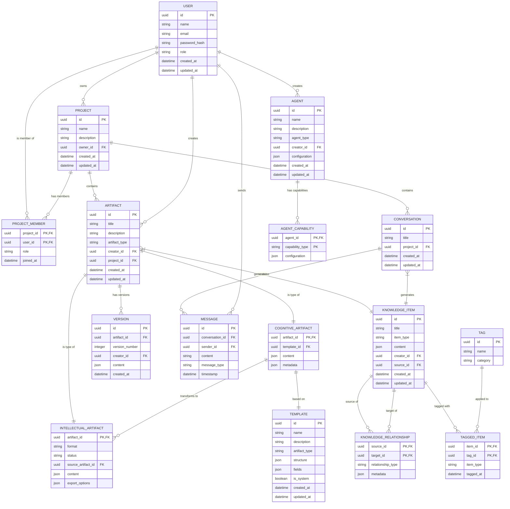
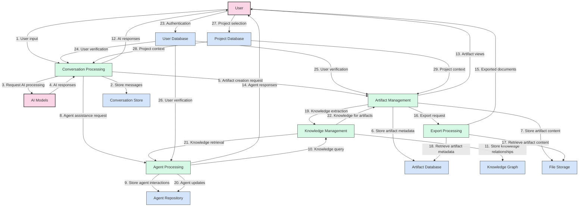

## 6. Data Design

### 6.1 Logical Data Model

```mermaid
erDiagram
    USER {
        uuid id PK
        string name
        string email
        string password_hash
        string role
        datetime created_at
        datetime updated_at
    }

    PROJECT {
        uuid id PK
        string name
        string description
        uuid owner_id FK
        datetime created_at
        datetime updated_at
    }

    PROJECT_MEMBER {
        uuid project_id PK,FK
        uuid user_id PK,FK
        string role
        datetime joined_at
    }

    ARTIFACT {
        uuid id PK
        string title
        string description
        string artifact_type
        uuid creator_id FK
        uuid project_id FK
        datetime created_at
        datetime updated_at
    }

    COGNITIVE_ARTIFACT {
        uuid artifact_id PK,FK
        uuid template_id FK
        json content
        json metadata
    }

    INTELLECTUAL_ARTIFACT {
        uuid artifact_id PK,FK
        string format
        string status
        uuid source_artifact_id FK
        json content
        json export_options
    }

    VERSION {
        uuid id PK
        uuid artifact_id FK
        integer version_number
        uuid creator_id FK
        json content
        datetime created_at
    }

    TEMPLATE {
        uuid id PK
        string name
        string description
        string artifact_type
        json structure
        json fields
        boolean is_system
        datetime created_at
        datetime updated_at
    }

    CONVERSATION {
        uuid id PK
        string title
        uuid project_id FK
        datetime created_at
        datetime updated_at
    }

    MESSAGE {
        uuid id PK
        uuid conversation_id FK
        uuid sender_id FK
        string content
        string message_type
        datetime timestamp
    }

    AGENT {
        uuid id PK
        string name
        string description
        string agent_type
        uuid creator_id FK
        json configuration
        datetime created_at
        datetime updated_at
    }

    AGENT_CAPABILITY {
        uuid agent_id PK,FK
        string capability_type PK
        json configuration
    }

    KNOWLEDGE_ITEM {
        uuid id PK
        string title
        string item_type
        json content
        uuid creator_id FK
        uuid source_id FK
        datetime created_at
        datetime updated_at
    }

    KNOWLEDGE_RELATIONSHIP {
        uuid source_id PK,FK
        uuid target_id PK,FK
        string relationship_type
        json metadata
    }

    TAG {
        uuid id PK
        string name
        string category
    }

    TAGGED_ITEM {
        uuid item_id PK,FK
        uuid tag_id PK,FK
        string item_type
        datetime tagged_at
    }

    USER ||--o{ PROJECT : "owns"
    USER ||--o{ PROJECT_MEMBER : "is member of"
    PROJECT ||--o{ PROJECT_MEMBER : "has members"
    PROJECT ||--o{ ARTIFACT : "contains"
    USER ||--o{ ARTIFACT : "creates"
    ARTIFACT ||--|| COGNITIVE_ARTIFACT : "is type of"
    ARTIFACT ||--|| INTELLECTUAL_ARTIFACT : "is type of"
    ARTIFACT ||--o{ VERSION : "has versions"
    COGNITIVE_ARTIFACT ||--o{ INTELLECTUAL_ARTIFACT : "transforms to"
    COGNITIVE_ARTIFACT ||--|| TEMPLATE : "based on"
    PROJECT ||--o{ CONVERSATION : "contains"
    CONVERSATION ||--o{ MESSAGE : "contains"
    USER ||--o{ MESSAGE : "sends"
    USER ||--o{ AGENT : "creates"
    AGENT ||--o{ AGENT_CAPABILITY : "has capabilities"
    KNOWLEDGE_ITEM ||--o{ KNOWLEDGE_RELATIONSHIP : "source of"
    KNOWLEDGE_ITEM ||--o{ KNOWLEDGE_RELATIONSHIP : "target of"
    KNOWLEDGE_ITEM ||--o{ TAGGED_ITEM : "tagged with"
    TAG ||--o{ TAGGED_ITEM : "applied to"
    ARTIFACT }|--|| KNOWLEDGE_ITEM : "generates"
    CONVERSATION }|--|| KNOWLEDGE_ITEM : "generates"
```

### 6.2 Physical Data Model

```mermaid
erDiagram
    users {
        uuid id PK
        string name "not null"
        string email "not null, unique"
        string password_hash "not null"
        string role "not null"
        timestamp created_at "not null"
        timestamp updated_at "not null"
        index email_idx "email"
    }

    projects {
        uuid id PK
        string name "not null"
        string description
        uuid owner_id FK "not null"
        timestamp created_at "not null"
        timestamp updated_at "not null"
        index owner_idx "owner_id"
    }

    project_members {
        uuid project_id PK,FK "not null"
        uuid user_id PK,FK "not null"
        string role "not null"
        timestamp joined_at "not null"
        index project_member_idx "project_id, user_id"
    }

    artifacts {
        uuid id PK
        string title "not null"
        string description
        string artifact_type "not null"
        uuid creator_id FK "not null"
        uuid project_id FK "not null"
        timestamp created_at "not null"
        timestamp updated_at "not null"
        index artifact_project_idx "project_id"
        index artifact_creator_idx "creator_id"
        index artifact_type_idx "artifact_type"
    }

    cognitive_artifacts {
        uuid artifact_id PK,FK "not null"
        uuid template_id FK "not null"
        jsonb content "not null"
        jsonb metadata
        index cog_template_idx "template_id"
    }

    intellectual_artifacts {
        uuid artifact_id PK,FK "not null"
        string format "not null"
        string status "not null"
        uuid source_artifact_id FK
        jsonb content "not null"
        jsonb export_options
        index int_source_idx "source_artifact_id"
        index int_format_idx "format"
        index int_status_idx "status"
    }

    versions {
        uuid id PK
        uuid artifact_id FK "not null"
        integer version_number "not null"
        uuid creator_id FK "not null"
        jsonb content "not null"
        timestamp created_at "not null"
        unique artifact_version_idx "artifact_id, version_number"
        index version_artifact_idx "artifact_id"
    }

    templates {
        uuid id PK
        string name "not null"
        string description
        string artifact_type "not null"
        jsonb structure "not null"
        jsonb fields "not null"
        boolean is_system "not null, default false"
        timestamp created_at "not null"
        timestamp updated_at "not null"
        index template_type_idx "artifact_type"
        index template_system_idx "is_system"
    }

    conversations {
        uuid id PK
        string title
        uuid project_id FK "not null"
        timestamp created_at "not null"
        timestamp updated_at "not null"
        index conversation_project_idx "project_id"
    }

    messages {
        uuid id PK
        uuid conversation_id FK "not null"
        uuid sender_id FK "not null"
        text content "not null"
        string message_type "not null"
        timestamp timestamp "not null"
        index message_conversation_idx "conversation_id"
        index message_sender_idx "sender_id"
        index message_time_idx "timestamp"
    }

    agents {
        uuid id PK
        string name "not null"
        string description
        string agent_type "not null"
        uuid creator_id FK "not null"
        jsonb configuration "not null"
        timestamp created_at "not null"
        timestamp updated_at "not null"
        index agent_creator_idx "creator_id"
        index agent_type_idx "agent_type"
    }

    agent_capabilities {
        uuid agent_id PK,FK "not null"
        string capability_type PK "not null"
        jsonb configuration "not null"
        index capability_agent_idx "agent_id"
    }

    knowledge_items {
        uuid id PK
        string title "not null"
        string item_type "not null"
        jsonb content "not null"
        uuid creator_id FK "not null"
        uuid source_id FK
        timestamp created_at "not null"
        timestamp updated_at "not null"
        index ki_creator_idx "creator_id"
        index ki_type_idx "item_type"
        index ki_source_idx "source_id"
    }

    knowledge_relationships {
        uuid source_id PK,FK "not null"
        uuid target_id PK,FK "not null"
        string relationship_type "not null"
        jsonb metadata
        index kr_source_idx "source_id"
        index kr_target_idx "target_id"
        index kr_type_idx "relationship_type"
    }

    tags {
        uuid id PK
        string name "not null"
        string category
        unique tag_name_idx "name, category"
    }

    tagged_items {
        uuid item_id PK,FK "not null"
        uuid tag_id PK,FK "not null"
        string item_type "not null"
        timestamp tagged_at "not null"
        index ti_item_idx "item_id, item_type"
        index ti_tag_idx "tag_id"
    }
```

### 6.3 Data Flow Diagram (DFD)

```mermaid
graph TD
    classDef external fill:#f9d5e5,stroke:#333,stroke-width:2px
    classDef process fill:#d5f9e5,stroke:#333,stroke-width:1px
    classDef datastore fill:#d5e5f9,stroke:#333,stroke-width:1px

    U[User]:::external
    AI[AI Models]:::external

    P1[Conversation Processing]:::process
    P2[Artifact Management]:::process
    P3[Agent Processing]:::process
    P4[Knowledge Management]:::process
    P5[Export Processing]:::process

    DS1[User Database]:::datastore
    DS2[Project Database]:::datastore
    DS3[Artifact Database]:::datastore
    DS4[Conversation Store]:::datastore
    DS5[Agent Repository]:::datastore
    DS6[Knowledge Graph]:::datastore
    DS7[File Storage]:::datastore

    %% User interactions
    U -->|1. User input| P1
    P1 -->|12. AI responses| U
    P2 -->|13. Artifact views| U
    P3 -->|14. Agent responses| U
    P5 -->|15. Exported documents| U

    %% Main data flows
    P1 -->|2. Store messages| DS4
    P1 -->|3. Request AI processing| AI
    AI -->|4. AI responses| P1

    P1 -->|5. Artifact creation request| P2
    P2 -->|6. Store artifact metadata| DS3
    P2 -->|7. Store artifact content| DS7

    P1 -->|8. Agent assistance request| P3
    P3 -->|9. Store agent interactions| DS5
    P3 -->|10. Knowledge query| P4

    P4 -->|11. Store knowledge relationships| DS6

    P2 -->|16. Export request| P5
    P5 -->|17. Retrieve artifact content| DS7
    P5 -->|18. Retrieve artifact metadata| DS3

    %% Secondary flows
    P2 -->|19. Knowledge extraction| P4
    P3 -->|20. Agent updates| DS5
    P4 -->|21. Knowledge retrieval| P3
    P4 -->|22. Knowledge for artifacts| P2

    %% Authentication flows
    U -->|23. Authentication| DS1
    DS1 -->|24. User verification| P1
    DS1 -->|25. User verification| P2
    DS1 -->|26. User verification| P3

    %% Project context
    U -->|27. Project selection| DS2
    DS2 -->|28. Project context| P1
    DS2 -->|29. Project context| P2
```
