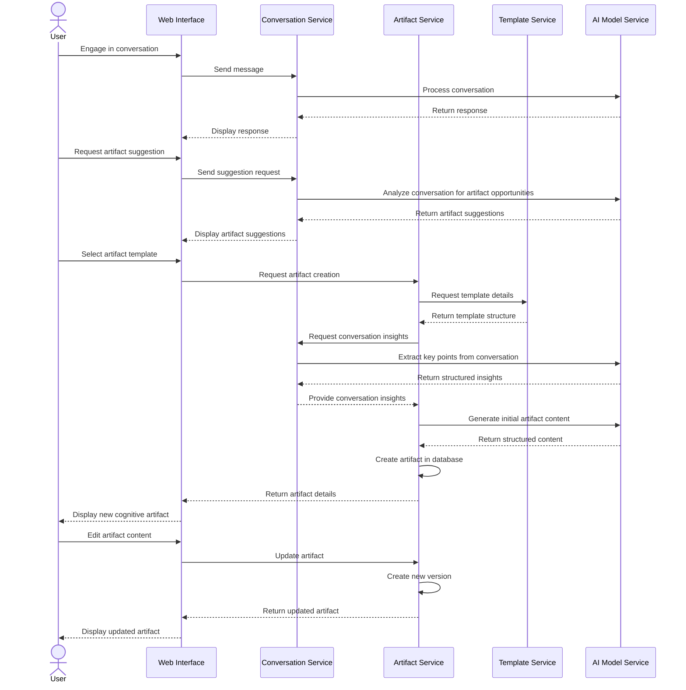
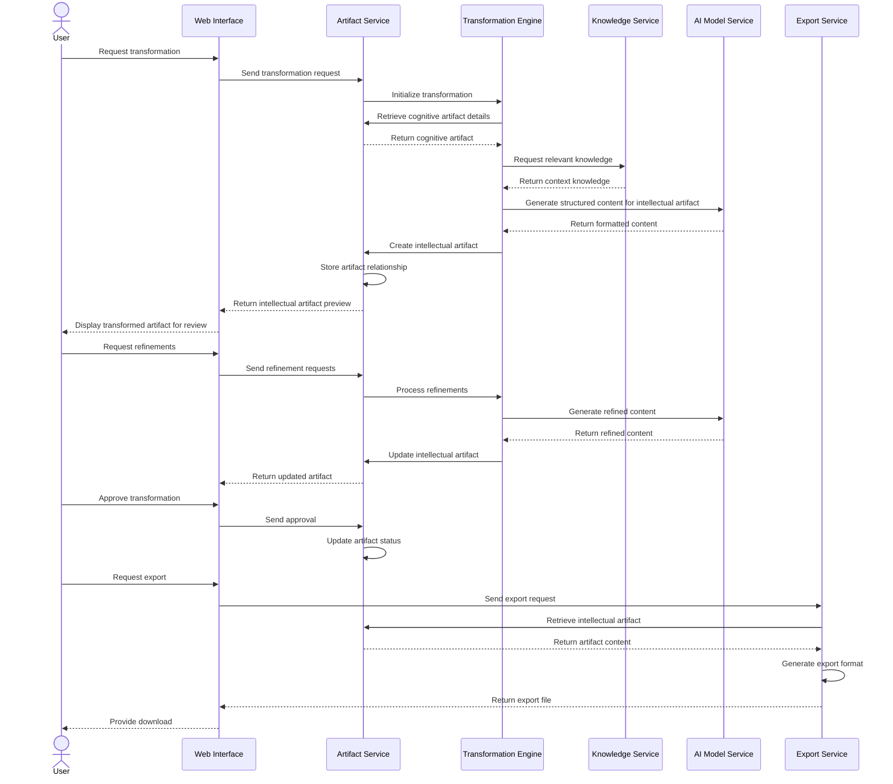
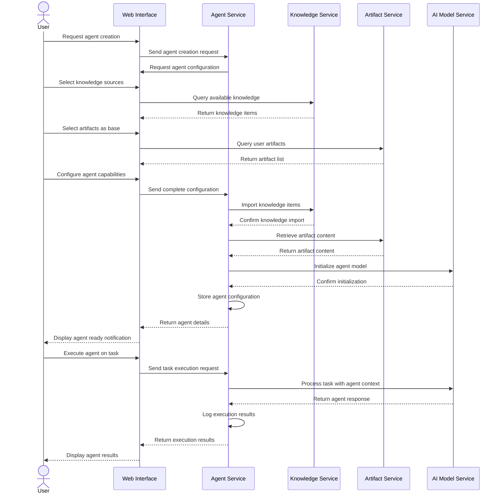
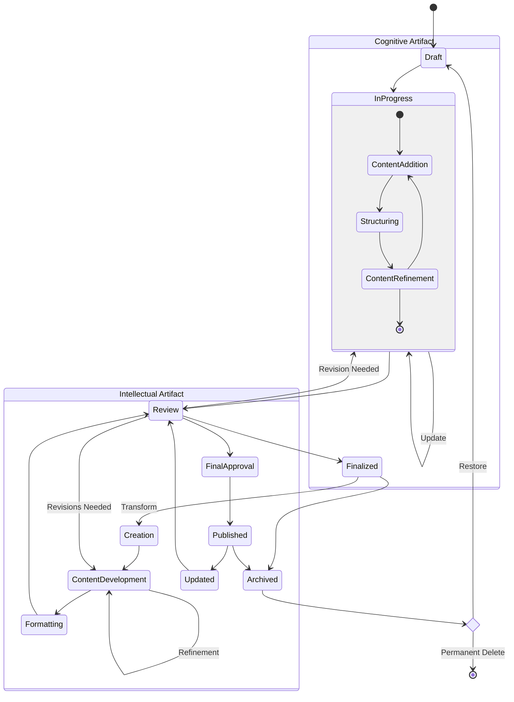
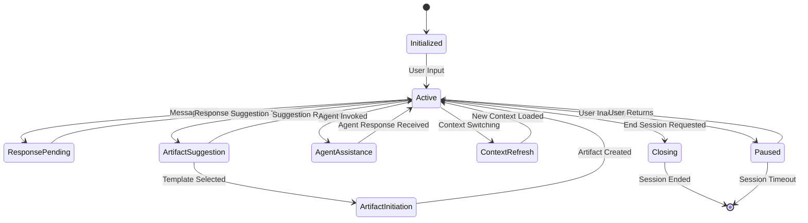
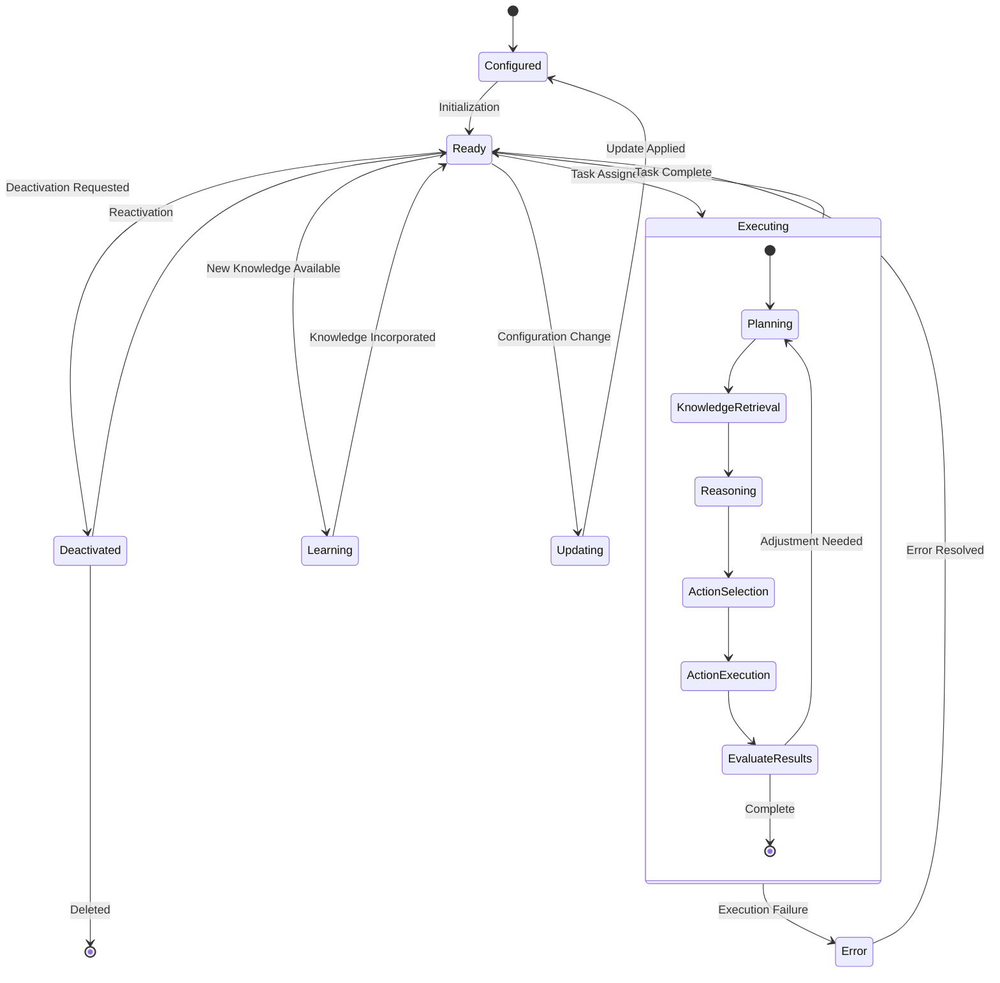
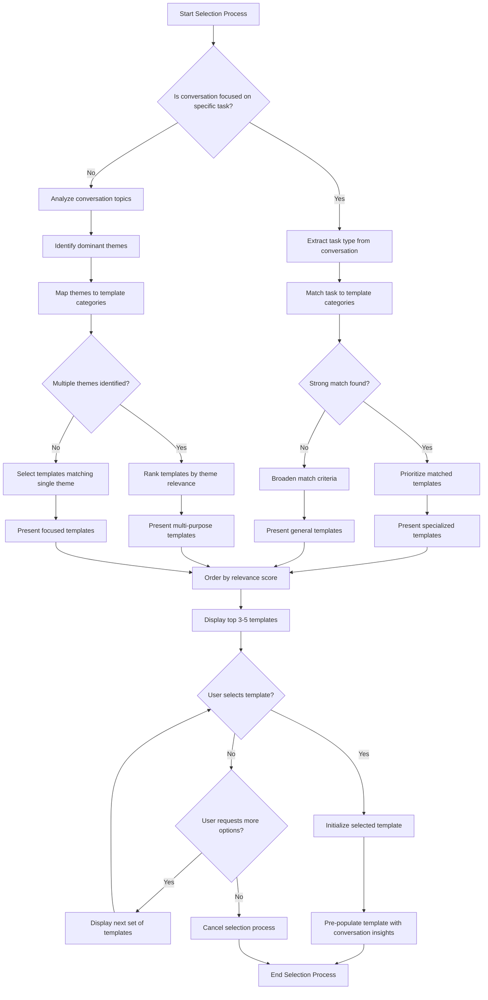
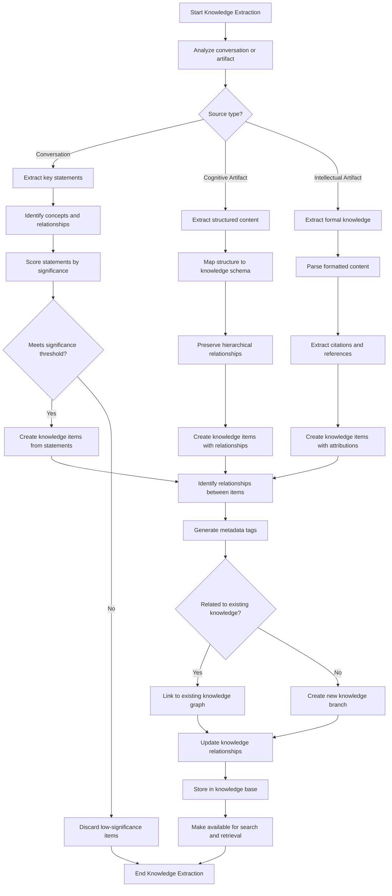
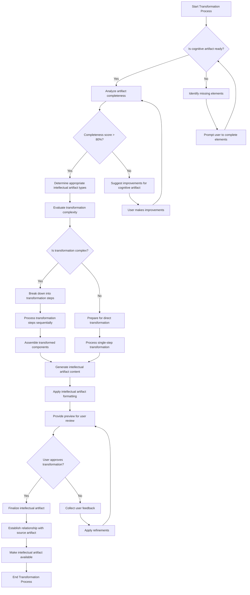

## 7. Workflow Design

### 7.1 Sequence Diagrams

#### Artifact Creation from Conversation

#### Cognitive to Intellectual Artifact Transformation

#### Agent Creation and Execution

### 7.2 State Diagrams

#### Artifact Lifecycle States

#### Conversation Session States

#### Agent Execution States

### 7.3 Flowcharts

#### Artifact Template Selection Process

#### Knowledge Extraction Process

#### Transformation Decision Process

