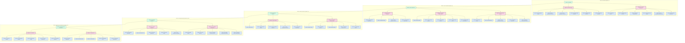
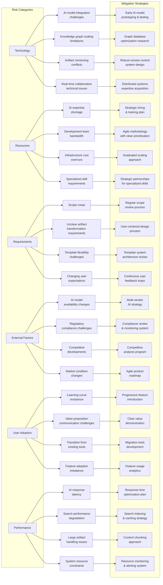

## 8. Implementation Plan

### 8.1 Development Phases

```mermaid
graph TD
    classDef milestone fill:#f9d5e5,stroke:#333,stroke-width:2px
    classDef phase fill:#d5f9e5,stroke:#333,stroke-width:1px
    classDef task fill:#d5e5f9,stroke:#333,stroke-width:1px

    subgraph "Phase 1: Foundation (Months 1-3)"
        P1[Phase 1: Foundation]:::phase

        M1[Milestone 1: System Architecture]:::milestone

        T1[Task 1.1: Define System Architecture]:::task
        T2[Task 1.2: Set Up Development Environment]:::task
        T3[Task 1.3: Create Core Data Models]:::task
        T4[Task 1.4: Implement Authentication]:::task
        T5[Task 1.5: Establish Project Structure]:::task
        T6[Task 1.6: Architecture Review]:::task

        P1 --> M1
        M1 --> T1
        M1 --> T2
        M1 --> T3
        M1 --> T4
        M1 --> T5
        M1 --> T6

        M2[Milestone 2: Basic Interface]:::milestone

        T7[Task 2.1: Design UI/UX Mockups]:::task
        T8[Task 2.2: Implement Web Frontend]:::task
        T9[Task 2.3: Create Basic API Endpoints]:::task
        T10[Task 2.4: User Management Interface]:::task
        T11[Task 2.5: Project Management Interface]:::task
        T12[Task 2.6: User Acceptance Testing]:::task

        P1 --> M2
        M2 --> T7
        M2 --> T8
        M2 --> T9
        M2 --> T10
        M2 --> T11
        M2 --> T12
    end

    subgraph "Phase 2: Core Components (Months 4-6)"
        P2[Phase 2: Core Components]:::phase

        M3[Milestone 3: Conversation System]:::milestone

        T13[Task 3.1: Implement Conversation Service]:::task
        T14[Task 3.2: Integrate AI Model API]:::task
        T15[Task 3.3: Context Management System]:::task
        T16[Task 3.4: Conversation UI]:::task
        T17[Task 3.5: Conversation Testing]:::task

        P2 --> M3
        M3 --> T13
        M3 --> T14
        M3 --> T15
        M3 --> T16
        M3 --> T17

        M4[Milestone 4: Cognitive Artifact System]:::milestone

        T18[Task 4.1: Template Engine Development]:::task
        T19[Task 4.2: Cognitive Artifact Service]:::task
        T20[Task 4.3: Artifact Editor Interface]:::task
        T21[Task 4.4: Version Control System]:::task
        T22[Task 4.5: Artifact Testing]:::task

        P2 --> M4
        M4 --> T18
        M4 --> T19
        M4 --> T20
        M4 --> T21
        M4 --> T22

        M5[Milestone 5: Initial Integration]:::milestone

        T23[Task 5.1: Conversation to Artifact Flow]:::task
        T24[Task 5.2: Artifact Suggestion System]:::task
        T25[Task 5.3: Integrated Testing]:::task
        T26[Task 5.4: Alpha Release Preparation]:::task

        P2 --> M5
        M5 --> T23
        M5 --> T24
        M5 --> T25
        M5 --> T26
    end

    subgraph "Phase 3: Advanced Features (Months 7-9)"
        P3[Phase 3: Advanced Features]:::phase

        M6[Milestone 6: Intellectual Artifact System]:::milestone

        T27[Task 6.1: Transformation Engine]:::task
        T28[Task 6.2: Intellectual Artifact Service]:::task
        T29[Task 6.3: Export System]:::task
        T30[Task 6.4: Publishing Interface]:::task
        T31[Task 6.5: Feature Testing]:::task

        P3 --> M6
        M6 --> T27
        M6 --> T28
        M6 --> T29
        M6 --> T30
        M6 --> T31

        M7[Milestone 7: Agent System]:::milestone

        T32[Task 7.1: Agent Service Development]:::task
        T33[Task 7.2: Agent Configuration Interface]:::task
        T34[Task 7.3: Agent Knowledge Integration]:::task
        T35[Task 7.4: Agent Execution Engine]:::task
        T36[Task 7.5: Agent Testing]:::task

        P3 --> M7
        M7 --> T32
        M7 --> T33
        M7 --> T34
        M7 --> T35
        M7 --> T36
    end

    subgraph "Phase 4: Knowledge Integration (Months 10-12)"
        P4[Phase 4: Knowledge Integration]:::phase

        M8[Milestone 8: Knowledge Management]:::milestone

        T37[Task 8.1: Knowledge Service Development]:::task
        T38[Task 8.2: Knowledge Graph Implementation]:::task
        T39[Task 8.3: Knowledge Extraction System]:::task
        T40[Task 8.4: Search and Retrieval]:::task
        T41[Task 8.5: Knowledge Testing]:::task

        P4 --> M8
        M8 --> T37
        M8 --> T38
        M8 --> T39
        M8 --> T40
        M8 --> T41

        M9[Milestone 9: System Integration]:::milestone

        T42[Task 9.1: Cross-Component Integration]:::task
        T43[Task 9.2: End-to-End Testing]:::task
        T44[Task 9.3: Performance Optimization]:::task
        T45[Task 9.4: Security Review]:::task
        T46[Task 9.5: Beta Release Preparation]:::task

        P4 --> M9
        M9 --> T42
        M9 --> T43
        M9 --> T44
        M9 --> T45
        M9 --> T46
    end

    subgraph "Phase 5: Deployment and Refinement (Months 13-15)"
        P5[Phase 5: Deployment and Refinement]:::phase

        M10[Milestone 10: Deployment]:::milestone

        T47[Task 10.1: Deployment Infrastructure]:::task
        T48[Task 10.2: Data Migration Tools]:::task
        T49[Task 10.3: CI/CD Pipeline]:::task
        T50[Task 10.4: Monitoring Setup]:::task
        T51[Task 10.5: Production Deployment]:::task

        P5 --> M10
        M10 --> T47
        M10 --> T48
        M10 --> T49
        M10 --> T50
        M10 --> T51

        M11[Milestone 11: Refinement]:::milestone

        T52[Task 11.1: User Feedback Collection]:::task
        T53[Task 11.2: Feature Refinements]:::task
        T54[Task 11.3: Performance Tuning]:::task
        T55[Task 11.4: Documentation Updates]:::task
        T56[Task 11.5: Version 1.0 Release]:::task

        P5 --> M11
        M11 --> T52
        M11 --> T53
        M11 --> T54
        M11 --> T55
        M11 --> T56
    end

    P1 --> P2
    P2 --> P3
    P3 --> P4
    P4 --> P5
```

### 8.2 Risk Assessment

```mermaid
graph LR
    subgraph "Risk Categories"
        RC1[Technology]
        RC2[Resources]
        RC3[Requirements]
        RC4[External Factors]
        RC5[User Adoption]
        RC6[Performance]
    end

    RC1 --> R1[AI model integration<br>challenges]
    RC1 --> R2[Knowledge graph scaling<br>limitations]
    RC1 --> R3[Artifact versioning<br>conflicts]
    RC1 --> R4[Real-time collaboration<br>technical issues]

    RC2 --> R5[AI expertise<br>shortage]
    RC2 --> R6[Development team<br>bandwidth]
    RC2 --> R7[Infrastructure cost<br>overruns]
    RC2 --> R8[Specialized skill<br>requirements]

    RC3 --> R9[Scope creep]
    RC3 --> R10[Unclear artifact<br>transformation requirements]
    RC3 --> R11[Template flexibility<br>challenges]
    RC3 --> R12[Changing user<br>expectations]

    RC4 --> R13[AI model<br>availability changes]
    RC4 --> R14[Regulatory<br>compliance challenges]
    RC4 --> R15[Competitive<br>developments]
    RC4 --> R16[Market condition<br>changes]

    RC5 --> R17[Learning curve<br>resistance]
    RC5 --> R18[Value proposition<br>communication challenges]
    RC5 --> R19[Transition from<br>existing tools]
    RC5 --> R20[Feature adoption<br>imbalance]

    RC6 --> R21[AI response<br>latency]
    RC6 --> R22[Search performance<br>degradation]
    RC6 --> R23[Large artifact<br>handling issues]
    RC6 --> R24[System resource<br>constraints]

    subgraph "Mitigation Strategies"
        M1[Early AI model<br>prototyping & testing]
        M2[Graph database<br>optimization research]
        M3[Robust version control<br>system design]
        M4[Distributed systems<br>expertise acquisition]

        M5[Strategic hiring<br>& training plan]
        M6[Agile methodology<br>with clear prioritization]
        M7[Graduated scaling<br>approach]
        M8[Strategic partnerships<br>for specialized skills]

        M9[Regular scope<br>review process]
        M10[User-centered design<br>process]
        M11[Template system<br>architecture review]
        M12[Continuous user<br>feedback loops]

        M13[Multi-vendor<br>AI strategy]
        M14[Compliance review<br>& monitoring system]
        M15[Competitive<br>analysis program]
        M16[Agile product<br>roadmap]

        M17[Progressive feature<br>introduction]
        M18[Clear value<br>demonstration]
        M19[Migration tools<br>development]
        M20[Feature usage<br>analytics]

        M21[Response time<br>optimization plan]
        M22[Search indexing<br>& caching strategy]
        M23[Content chunking<br>approach]
        M24[Resource monitoring<br>& alerting system]
    end

    R1 --> M1
    R2 --> M2
    R3 --> M3
    R4 --> M4

    R5 --> M5
    R6 --> M6
    R7 --> M7
    R8 --> M8

    R9 --> M9
    R10 --> M10
    R11 --> M11
    R12 --> M12

    R13 --> M13
    R14 --> M14
    R15 --> M15
    R16 --> M16

    R17 --> M17
    R18 --> M18
    R19 --> M19
    R20 --> M20

    R21 --> M21
    R22 --> M22
    R23 --> M23
    R24 --> M24
```
