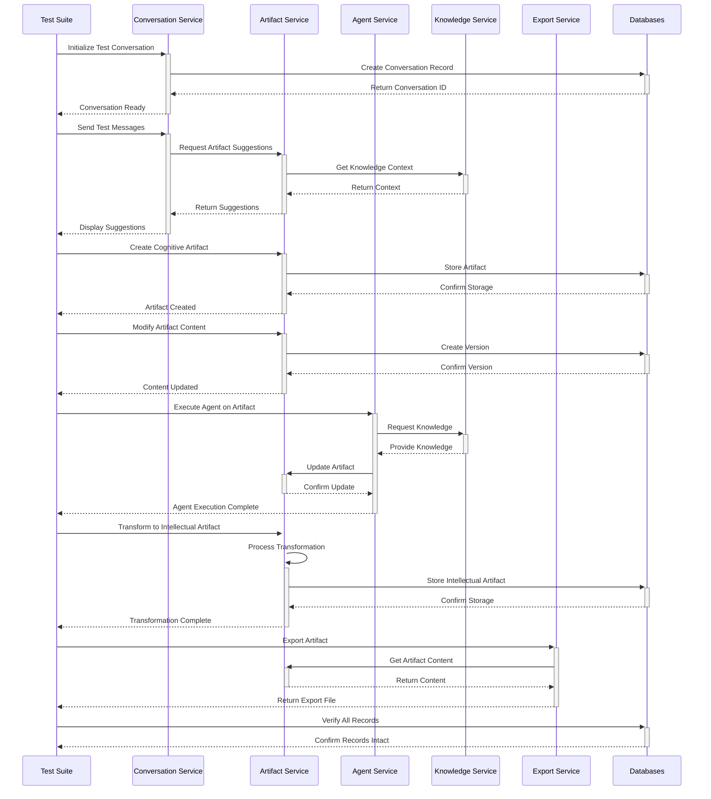
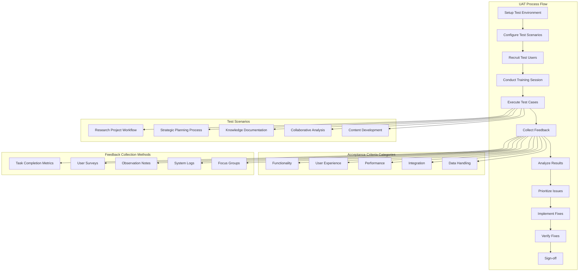

## 9. Testing Plan

### 9.1 Test Scenarios

```mermaid
graph TD
    subgraph "Test Coverage Matrix"
        classDef functional fill:#d5f9e5,stroke:#333,stroke-width:1px
        classDef integration fill:#f9d5e5,stroke:#333,stroke-width:1px
        classDef performance fill:#d5e5f9,stroke:#333,stroke-width:1px
        classDef security fill:#f9e5d5,stroke:#333,stroke-width:1px
        classDef usability fill:#e5d5f9,stroke:#333,stroke-width:1px

        subgraph "Conversation System Tests"
            CS1[TC-C-01: Basic Conversation Flow]:::functional
            CS2[TC-C-02: Context Preservation]:::functional
            CS3[TC-C-03: Multi-turn Dialogue]:::functional
            CS4[TC-C-04: Conversation History]:::functional
            CS5[TC-C-05: Conversation Load Testing]:::performance
            CS6[TC-C-06: AI Integration]:::integration
        end

        subgraph "Cognitive Artifact Tests"
            CA1[TC-CA-01: Template Selection]:::functional
            CA2[TC-CA-02: Artifact Creation]:::functional
            CA3[TC-CA-03: Content Editing]:::functional
            CA4[TC-CA-04: Version Control]:::functional
            CA5[TC-CA-05: Artifact Performance]:::performance
            CA6[TC-CA-06: Template Flexibility]:::functional
        end

        subgraph "Intellectual Artifact Tests"
            IA1[TC-IA-01: Transformation Process]:::functional
            IA2[TC-IA-02: Format Options]:::functional
            IA3[TC-IA-03: Export Functionality]:::functional
            IA4[TC-IA-04: Publishing Process]:::functional
            IA5[TC-IA-05: Large Content Handling]:::performance
            IA6[TC-IA-06: Format Consistency]:::functional
        end

        subgraph "Agent System Tests"
            AG1[TC-AG-01: Agent Creation]:::functional
            AG2[TC-AG-02: Agent Execution]:::functional
            AG3[TC-AG-03: Knowledge Integration]:::functional
            AG4[TC-AG-04: Multi-Agent Interaction]:::functional
            AG5[TC-AG-05: Agent Response Time]:::performance
            AG6[TC-AG-06: Agent Security Controls]:::security
        end

        subgraph "Knowledge Management Tests"
            KM1[TC-KM-01: Knowledge Extraction]:::functional
            KM2[TC-KM-02: Knowledge Retrieval]:::functional
            KM3[TC-KM-03: Knowledge Graph Navigation]:::functional
            KM4[TC-KM-04: Search Functionality]:::functional
            KM5[TC-KM-05: Large Knowledge Base]:::performance
            KM6[TC-KM-06: Knowledge Privacy]:::security
        end

        subgraph "User Interface Tests"
            UI1[TC-UI-01: Responsive Design]:::usability
            UI2[TC-UI-02: Accessibility]:::usability
            UI3[TC-UI-03: Navigation Flow]:::usability
            UI4[TC-UI-04: Real-time Updates]:::functional
            UI5[TC-UI-05: UI Performance]:::performance
            UI6[TC-UI-06: Multi-device Support]:::functional
        end

        subgraph "Security Tests"
            SE1[TC-SE-01: Authentication]:::security
            SE2[TC-SE-02: Authorization]:::security
            SE3[TC-SE-03: Data Encryption]:::security
            SE4[TC-SE-04: Input Validation]:::security
            SE5[TC-SE-05: Penetration Testing]:::security
            SE6[TC-SE-06: Audit Logging]:::security
        end

        subgraph "Integration Tests"
            IN1[TC-IN-01: Conversation to Artifact]:::integration
            IN2[TC-IN-02: Artifact to Knowledge]:::integration
            IN3[TC-IN-03: Agent to Artifact]:::integration
            IN4[TC-IN-04: Knowledge to Agent]:::integration
            IN5[TC-IN-05: End-to-End Flow]:::integration
            IN6[TC-IN-06: External System Integration]:::integration
        end
    end

    subgraph "User Stories"
        US1[US-01: Project Creation]
        US2[US-02: Conversation Engagement]
        US3[US-03: Artifact Generation]
        US4[US-04: Artifact Transformation]
        US5[US-05: Agent Creation]
        US6[US-06: Knowledge Search]
        US7[US-07: Export & Publishing]
        US8[US-08: Team Collaboration]
    end

    US1 --> CS1
    US1 --> UI3
    US1 --> SE1
    US1 --> SE2

    US2 --> CS1
    US2 --> CS2
    US2 --> CS3
    US2 --> CS4
    US2 --> UI4

    US3 --> CS1
    US3 --> CS2
    US3 --> CA1
    US3 --> CA2
    US3 --> CA3
    US3 --> CA4
    US3 --> IN1

    US4 --> CA4
    US4 --> IA1
    US4 --> IA2
    US4 --> IA3
    US4 --> IA4

    US5 --> AG1
    US5 --> AG2
    US5 --> AG3
    US5 --> KM2

    US6 --> KM2
    US6 --> KM3
    US6 --> KM4
    US6 --> UI3

    US7 --> IA3
    US7 --> IA4
    US7 --> IN6

    US8 --> SE1
    US8 --> SE2
    US8 --> CA4
    US8 --> UI4
```

#### Test Scenario Details - Key Examples

| Test ID | Description | Preconditions | Steps | Expected Results | Data Requirements |
|---------|-------------|---------------|-------|------------------|-------------------|
| TC-C-02 | Verify that conversation context is preserved between interactions | User is logged in, Project is created | 1. User starts conversation 2. User references previous statements 3. User switches to another feature 4. User returns to conversation | 1. Conversation initiates successfully 2. AI responses reflect understanding of previous context 3. Context is maintained after feature switch 4. Full conversation history is retrieved | Sample conversation with contextual references |
| TC-CA-02 | Verify complete cognitive artifact creation flow | User is logged in, Conversation has taken place | 1. User requests artifact suggestion 2. User selects template 3. System populates template 4. User edits content 5. User saves artifact | 1. Relevant templates are suggested 2. Template is loaded 3. Initial content is populated from conversation 4. Edits are saved in real-time 5. Artifact is stored with metadata | Conversation with topic suitable for artifact creation |
| TC-IA-01 | Verify transformation from cognitive to intellectual artifact | User is logged in, Cognitive artifact is complete | 1. User initiates transformation 2. System analyzes cognitive artifact 3. System generates intellectual artifact 4. User reviews and edits 5. User finalizes transformation | 1. Transformation process begins 2. Analysis completes without errors 3. Intellectual artifact created with proper formatting 4. Edits are preserved 5. Relationship to source artifact is maintained | Complete cognitive artifact ready for transformation |
| TC-AG-02 | Verify agent execution on knowledge tasks | User is logged in, Agent is configured | 1. User assigns task to agent 2. Agent processes task 3. Agent accesses knowledge 4. Agent generates response 5. Response is presented to user | 1. Task is queued for agent 2. Processing indicators are shown 3. Related knowledge is retrieved 4. Response is generated within SLA 5. Response is properly formatted | Configured agent with knowledge base access |
| TC-KM-04 | Verify search functionality across knowledge assets | User is logged in, Knowledge base contains items | 1. User enters search query 2. System executes search 3. Results are displayed 4. User refines search 5. User selects result | 1. Search is accepted 2. Search executes within performance SLA 3. Relevant results are displayed with ranking 4. Refined search updates results 5. Selected item opens correctly | Knowledge base with searchable items |
| TC-IN-05 | Verify complete end-to-end workflow | User is logged in, Project is created | 1. User starts conversation 2. Conversation generates artifact 3. Artifact evolves through edits 4. Artifact transforms to intellectual output 5. Output is exported | 1. Conversation flows correctly 2. Artifact creation succeeds 3. Edits are preserved 4. Transformation completes successfully 5. Export format is correct | Test data for complete workflow |

### 9.2 Testing Diagrams

#### Unit Testing Strategy

```mermaid
graph TD
    subgraph "Unit Testing Framework"
        UT1[Test Suite Organization]
        UT2[Component Isolation]
        UT3[Mock Dependencies]
        UT4[Coverage Targets]
        UT5[Automation Integration]
    end

    UT1 --> UT1A[Service-level Test Suites]
    UT1 --> UT1B[Component-level Test Suites]
    UT1 --> UT1C[Utility-level Test Suites]

    UT2 --> UT2A[Interface-based Testing]
    UT2 --> UT2B[Dependency Injection]
    UT2 --> UT2C[Component Factories]

    UT3 --> UT3A[Mock Service Providers]
    UT3 --> UT3B[Mock Data Sources]
    UT3 --> UT3C[Mock External Systems]

    UT4 --> UT4A[90% Code Coverage Target]
    UT4 --> UT4B[Critical Path Priority]
    UT4 --> UT4C[Edge Case Identification]

    UT5 --> UT5A[CI Pipeline Integration]
    UT5 --> UT5B[Pre-commit Hooks]
    UT5 --> UT5C[Reporting Automation]

    subgraph "Key Test Focus Areas"
        TFA1[Template Engine]
        TFA2[Artifact Transformation Logic]
        TFA3[Agent Execution Engine]
        TFA4[Knowledge Graph Operations]
        TFA5[Context Management System]
    end

    TFA1 --> TFA1A[Template Parsing]
    TFA1 --> TFA1B[Variable Substitution]
    TFA1 --> TFA1C[Template Validation]

    TFA2 --> TFA2A[Content Extraction]
    TFA2 --> TFA2B[Structure Mapping]
    TFA2 --> TFA2C[Format Conversion]

    TFA3 --> TFA3A[Capability Resolution]
    TFA3 --> TFA3B[Knowledge Integration]
    TFA3 --> TFA3C[Action Execution]

    TFA4 --> TFA4A[Node Operations]
    TFA4 --> TFA4B[Relationship Management]
    TFA4 --> TFA4C[Query Processing]

    TFA5 --> TFA5A[Context Preservation]
    TFA5 --> TFA5B[Context Switching]
    TFA5 --> TFA5C[Context Merging]
```

#### Integration Test Sequence

#### User Acceptance Testing Flow

